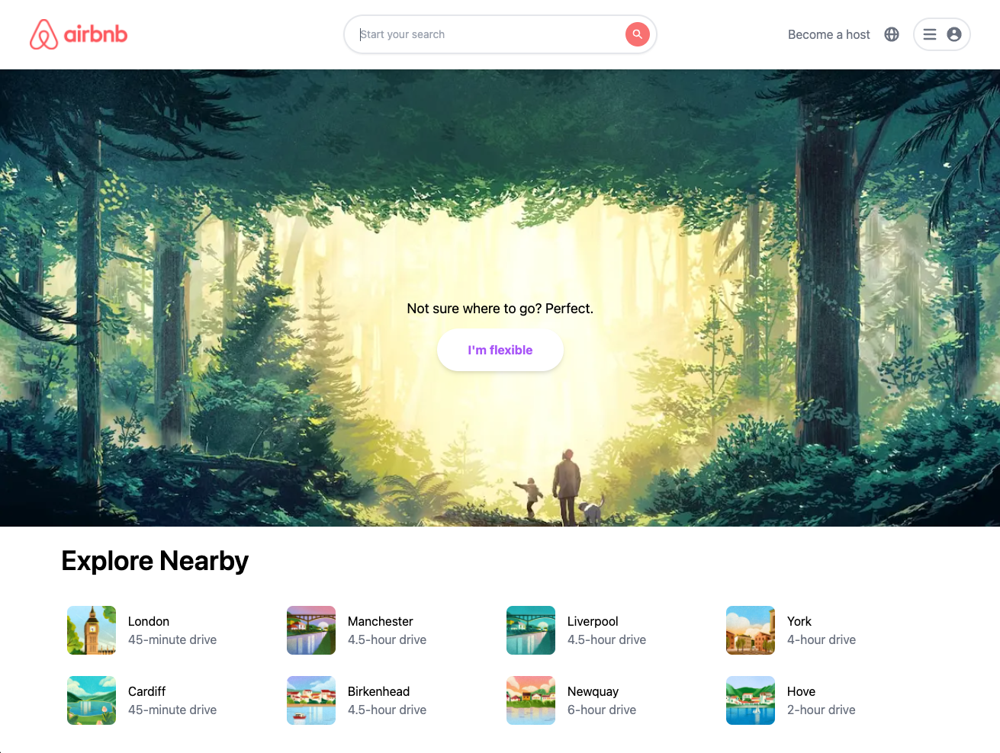
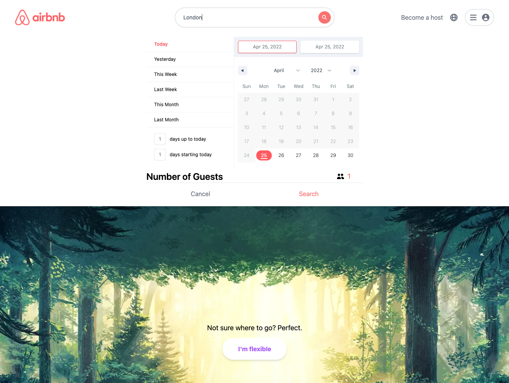
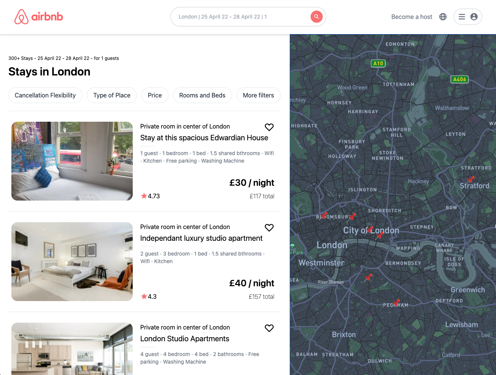

# Airbnb Clone
> Built with Next, Tailwind CSS and Mapbox. Based on Sonny Songha's Airbnb Clone tutorial.
> Live demo [_here_](https://airbnb-clone2-seven.vercel.app). <!-- If you have the project hosted somewhere, include the link here. -->

## Table of Contents
* [General Info](#general-information)
* [Technologies Used](#technologies-used)
* [Features](#features)
* [Screenshots](#screenshots)
* [Project Status](#project-status)
* [Room for Improvement](#room-for-improvement)
* [Acknowledgements](#acknowledgements)

## General Information
- I wanted some experience using Next as I'm getting more into React and loved the simplicty of the framework. Routing and SSR were a bit difficult to get to grips with initially but the more work with it, the better. As I'm working more on a component based architecture through React and Next, I can see the benefit of building applications using these libraries and frameworks.
<!-- You don't have to answer all the questions - just the ones relevant to your project. -->

## Technologies Used
- Next - v12.1.5
- React - v18.0.0
- MapboxGL - v2.8.2
- Date-FNS - v2.28.0

## Features
- Responsive media sizing through Tailwind
- Page routing through Next Router
- Loading bar to show loading progress using Bar-of-progress library from @badrap
- Selectable calendar
- Map, both draggable and resizable, through Mapbox

## Screenshots

## Project Status
Project is: _complete_ 

## Room for Improvement
- Pin location information inconsistantly pops up on map, need to find out why 
- Spacing on mobile for the search results could be a bit cleaner

## Acknowledgements
- This project was based on [this tutorial](https://youtu.be/ifcODOhSH1o) from Sonny Sangha.
